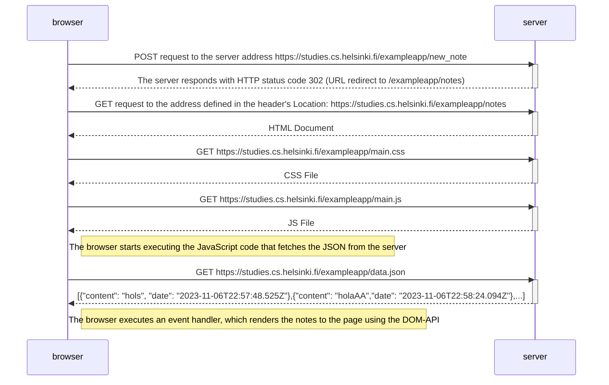

```mermaid
sequenceDiagram
    participant browser
    participant server

    browser->>server: POST request to the server address https://studies.cs.helsinki.fi/exampleapp/new_note
    activate server
    server-->>browser: The server responds with HTTP status code 302 (URL redirect to /exampleapp/notes)
    deactivate server

    browser->>server: GET request to the address defined in the header's Location: https://studies.cs.helsinki.fi/exampleapp/notes
    activate server
    server-->>browser: HTML Document
    deactivate server

    browser->>server: GET https://studies.cs.helsinki.fi/exampleapp/main.css
    activate server
    server-->>browser: CSS File
    deactivate server

    browser->>server: GET https://studies.cs.helsinki.fi/exampleapp/main.js
    activate server
    server-->>browser: JS File
    deactivate server


    Note right of browser: The browser starts executing the JavaScript code that fetches the JSON from the server
    browser->>server: GET https://studies.cs.helsinki.fi/exampleapp/data.json
    activate server
    server-->>browser: [{"content": "hols", "date": "2023-11-06T22:57:48.525Z"},{"content": "holaAA","date": "2023-11-06T22:58:24.094Z"},...]
    deactivate server
    Note right of browser: The browser executes an event handler, which renders the notes to the page using the DOM-API
```
