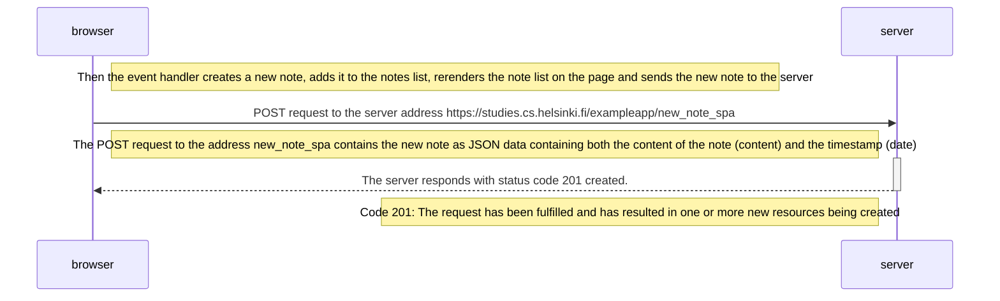

```mermaid
sequenceDiagram
    participant browser
    participant server

    Note right of browser: Then the event handler creates a new note, adds it to the notes list, rerenders the note list on the page and sends the new note to the server    
    browser->>server: POST request to the server address https://studies.cs.helsinki.fi/exampleapp/new_note_spa

    Note right of browser: The POST request to the address new_note_spa contains the new note as JSON data containing both the content of the note (content) and the timestamp (date)

    activate server
    server-->>browser: The server responds with status code 201 created.
    deactivate server

    Note left of server: Code 201: The request has been fulfilled and has resulted in one or more new resources being created
```
